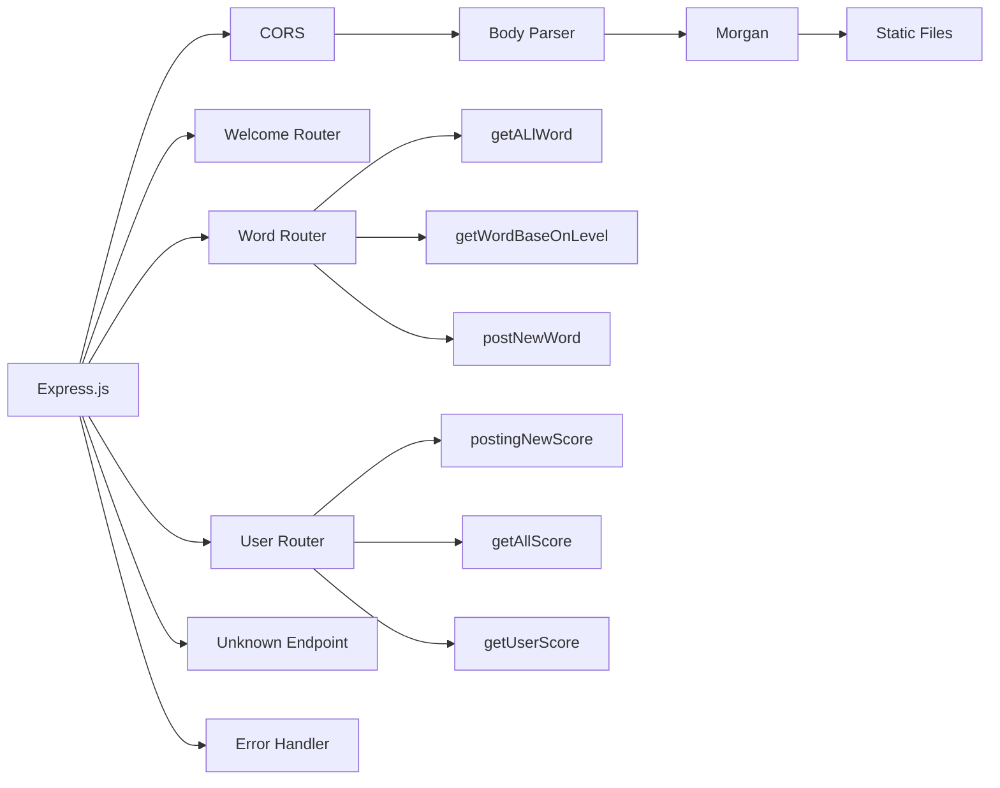

# Hangman Game with React & Redux Toolkit

This is a Hangman game built with React and Redux Toolkit. The game allows the user to guess a randomly generated word by entering letters one at a time. The user has a limited number of incorrect guesses, and each incorrect guess adds a part to a hangman figure. The game is won by guessing the word before the hangman is fully drawn, or lost by making too many incorrect guesses.

## Reference: 

1. we using concept introducted by "freecodecamp.org". 
https://www.freecodecamp.org/news/how-to-create-a-react-app-with-a-node-backend-the-complete-guide/

## Technologies

|  | Technology |
|------|----------------|
| Front_End | React Typescript|
| Back_End | Express/Node Typescript |
| State Management | Redux Tool Kit |
| UI | Figma, |
| Tesing | Jest, Postman for backend |
|Authentication | Firebase Authentication vs Context provider| 
|DataBase | Firebase |

## CLI: 

1. run install for all folder
```
npm run install:All
```
2. run backend development mode
```
npm run backendDev
```
3. run all application
```
npm run startall
```
4. build the whole application
```
npm run buildall
```

## Features
1. Word is generated from many category
2. Randomly generated word for each game,
3. Player can select to play all category to get 2 point each time, or 1 point if user play in specific category
4. Keeps track of correct and incorrect guesses
5. Hint, Player can click to unknown letter to show it, each time hint use, 1 point reduced.
6. Displays hangman figure as incorrect guesses are made
7. Shows a win or loss message at the end of the game
8. Player can see list of other player's record,
9. User can store their score by login/register.
## Getting Started
1. Clone the repository: git clone https://github.com/TuanDao-0110/Hang_Man_Game.git
2. Install dependencies: npm install or yarn install
3. Start the development server: npm start or yarn start
4. Open your browser to http://localhost:3000 to play the game.
## Contributing

This project is contributed by: 


| Name | GitHub Address |
|------|----------------|
| Valeria | https://github.com/pixelsnow |
| Eyvaz Alishov | https://github.com/CodeLaMat |


## Back End router: 
# Testing document API: 

https://documenter.getpostman.com/view/19888757/2s93JtR3uK#5877637a-3b0c-4673-87d8-962edb4f5a19 



## API Examples: 

* Welcome Page 
  * Method
    ```
    POST / HTTP/1.1 
    Host: localhost:4000
    Content-Type: text/html; charset=utf-8
    ```
  * Request Body
  * Response Body
    ```
    {
    statuscode:200
    text: welcome  to our hang man game
    }
    ```
* Word Router
  * Method GET all word
    ```
    GET /api/word HTTP/1.1
    Host: localhost:4000
    Content-Type: application/json
    ```
  * Request Body
  * Response Body
    ```
    {
    statusCode:200,  
    "result": {
        "easy": [
            "easyword"
        ],
        "hard": [
            "supperhard",
            "newword"
        ],
        "medium": [
            "mediumword"
        ]
    
      }
    }
    ```
  * Method GET word by level
    ```
    GET /api/word/:level HTTP/1.1
    Host: localhost:4000
    Content-Type: application/json
    ```
  * Request Body
  * Response Body
    ```
    {
    statusCode:200,  
    "result": [ "supperhard","newword"]
    }
    ```
  * Method POST new word
    ```
    POST /api/word/:level HTTP/1.1
    Host: localhost:4000
    Content-Type: application/json
    ```
  * Request Body
    ```
    {
      newword:'newword',
      level:'hard'
    }
    ```
    * Response Body
    ```
    {
    statusCode:201,  
   msg: add success
    }
    ```
* User Router 
  * Method Post new score
  ```
    POST /api/user/ HTTP/1.1
    Host: localhost:4000
    Content-Type: application/json
    Authorization: 'Bearer ${token}'
    ```
  * Request Body
    ```
    {
    score:100
    }
    ```
  * Response Body
    ```
    {
    statusCode:201,  
   msg: add success
    }
    ```
  * Method GET all score 
    ```
    GET /api/user/ HTTP/1.1
    Host: localhost:4000
    Content-Type: application/json
    Authorization: 'Bearer ${token}'
    ```
  * Request Body
  * Response Body
    ```
    {
    statusCode:200 
    result { 
      fowjfiewfijfowijf_uid:[
        {
          score:2424
          timeStamps:242042048
        },
         {
          score:2424
          timeStamps:242042048
        }
      ],
      2408jc2084hr2309d_uid:[
        {
          score:2424
          timeStamps:242042048
        },
         {
          score:2424
          timeStamps:242042048
        }
      ]
    }
    }
    ```
  * Method GET score by user uid
    ```
    GET /api/user/:uid HTTP/1.1
    Host: localhost:4000
    Content-Type: application/json
    Authorization: 'Bearer ${token}'
    ```
  * Request Body
  
  * Response Body

    ```
    {
    statusCode:200 
    scoreData:[
      {
        score:100,
        timeStamps:402422042
      },
      {
        score:100,
        timeStamps:402422042
      }
    ]
    userInfo:{
      name:
    }
    }
    ```


License
This project is licensed under the MIT License. See LICENSE for more information.


